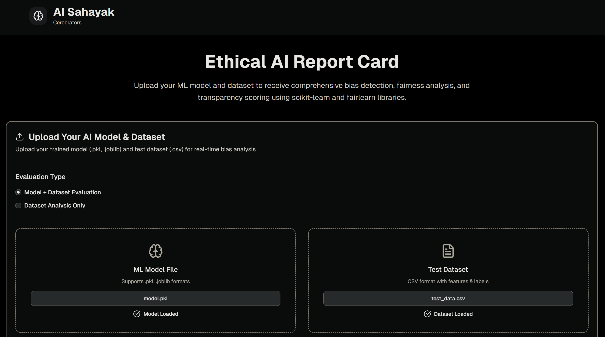
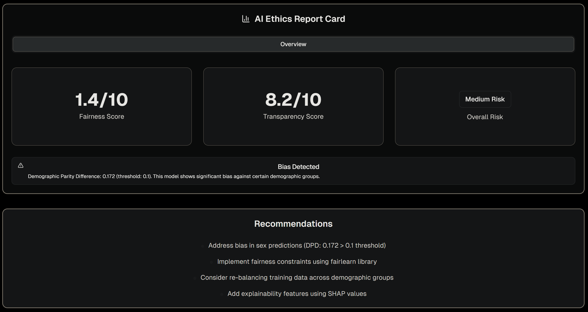

# AI-Sahayak: Ethical AI Governance Platform
AI-Sahayak is a comprehensive AI governance platform designed to evaluate machine learning models for bias, fairness, and transparency using rigorous mathematical frameworks in Machine Learning and AI Ethics.

<p align="center">
  
  
</p>

## Key Features
- **Fairness Auditing**: Manual implementation of Statistical Parity Difference (SPD), Disparate Impact (DI), and Equal Opportunity Difference (EOD).
- **Automated Bias Mitigation**: Dynamic calculation of post-processing threshold adjustments to equalize True Positive Rates across demographic groups.
- **Security & Robustness Audit**: 
  - **Stability Testing**: Measures model sensitivity by injecting Gaussian noise into numerical features.
  - **Privacy Leakage**: Evaluates "Attribute Inference Risk" to prevent sensitive data leakage from model outcomes.
- **Compliance & Documentation**:
  - **Regulatory Mapping**: Automated alignment with the **EU AI Act (Article 10)** and **India's NITI Aayog** ethical principles.
  - **Automated Model Cards**: Generates standardized documentation including Intended Use, Limitations, and Fairness Philosophy.

## Usage
1. **Select Audit Scope**: Choose between "End-to-End Audit" (Model + Dataset) or "Data-Only Ethics Audit".
2. **Upload Artifacts**:
   - **Model**: Upload your trained `.pkl` or `.joblib` Scikit-learn pipeline.
   - **Dataset**: Upload your test `.csv` samples.
3. **Define Sensitive Attribute**: Specify the column name representing the protected group (e.g., `sex`, `race`, `age`).
4. **Run Ethics Evaluation**: Perform a multi-pillar audit in seconds.
5. **View Results**:
   - **Overall Ethics Score (0-10)**: A weighted composite of Fairness, Robustness, and Privacy.
   - **Interactive Group Analysis**: Visualize selection rates and accuracy gaps.
   - **Actionable Mitigation Plan**: Specific instructions to fix detected biases.
   - **Compliance Report**: Audit-ready evidence for regulatory standards.

## How it Works
The platform is built on core AI ethics and machine learning principles:
- **Demographic Parity**: $P(\hat{Y}=1 | G=0) = P(\hat{Y}=1 | G=1)$
- **Disparate Impact**: $\frac{P(\hat{Y}=1 | G=unprivileged)}{P(\hat{Y}=1 | G=privileged)}$ (Applying the 80% rule)
- **Equal Opportunity**: Ensuring $TPR_{unprivileged} = TPR_{privileged}$ through threshold calibration.

## Installation & Setup

### Backend (Python)
```bash
cd python
pip install flask flask-cors pandas numpy scikit-learn joblib
python server.py
```

### Frontend (Next.js)
```bash
npm install
npm run dev
```

---
*Empowering Ethical Machine Learning*
